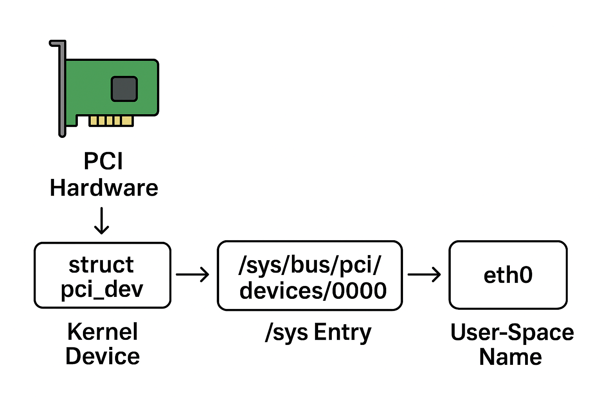

# how linux interact with hardware ?

## sysfs (pseudo file system)

### 🔹 What is sysfs?

- **sysfs** is a **virtual filesystem** provided by the Linux kernel.  
- It exposes **kernel objects, their attributes, and their relationships** to user space in a structured way.  
- Mounted typically at `/sys`, it lets you **interact with kernel internals** (especially the device model) through a simple **file-based API**.  

Think of it as:  
👉 `/proc` is for **processes and kernel state**  
👉 `/sys` is for **devices, drivers, buses, and kernel subsystems**  

---

### 🔹 Background

Before sysfs:

- The kernel had an internal **device model** (structs like `kobject`, `device`, `bus_type`, `class`, etc.).
- But user space had no **unified, structured way** to query this info. Different tools hacked it from `/proc`.

Sysfs was introduced in Linux **2.5.x** kernels by **Patrick Mochel** to expose this model cleanly.

---

### 🔹 The Core Idea: kobjects

At the heart of sysfs is the **kobject** (`struct kobject`).  

- It represents a kernel object with:
  - A **name**  
  - A **reference counter**  
  - A **parent** (hierarchy)  
  - A **sysfs entry**  

So whenever you register a kobject (directly or indirectly), sysfs exposes it as a **directory**.  
Example: `/sys/class/net/eth0/`

---

### 🔹 sysfs Layout

When mounted (`mount -t sysfs sysfs /sys`), sysfs exposes directories reflecting kernel subsystems:

- `/sys/block/` → block devices (e.g., disks)  
- `/sys/class/` → abstract device classes (e.g., `net`, `tty`, `power_supply`)  
- `/sys/devices/` → actual physical + virtual device tree  
- `/sys/bus/` → registered buses (PCI, USB, I2C, etc.)  
- `/sys/fs/` → filesystems info (cgroups, FUSE, etc.)  
- `/sys/kernel/` → general kernel settings  
- `/sys/module/` → loaded kernel modules and their parameters  

---

### 🔹 Attributes (Files in sysfs)

Every file under `/sys` is not a “real” file on disk.  
Instead:

- It corresponds to a **kernel attribute**.  
- Reading/writing it triggers kernel callbacks.  

For example:  

```bash
cat /sys/class/net/eth0/address
# -> Prints MAC address (read callback)

echo 1 > /sys/block/sda/device/delete
# -> Tells the kernel to delete a block device (write callback)
```

- **Attributes are small**: max 4 KB (the kernel enforces this).  
- That’s why sysfs is for **configuration/state**, not bulk data.

---

### 🔹 How It Works Inside the Kernel

1. **kobjects** → registered into the kernel object hierarchy.  
2. **ksets** → groups of kobjects (e.g., “all block devices”).  
3. **subsystems** → higher-level domains (e.g., “block subsystem”).  
4. **attributes** → exported as files with show/store methods:  

    ```c
        ssize_t show(struct kobject *kobj, struct kobj_attribute *attr, char *buf);
        ssize_t store(struct kobject *kobj, struct kobj_attribute *attr, const char *buf, size_t count);
    ```

5. The Virtual Filesystem (VFS) layer maps file ops (`read`, `write`) to these callbacks.

---

### 🔹 Example: A Device in sysfs

Suppose you plug in a USB stick. Sysfs shows:

```txt
/sys/devices/pci0000:00/0000:00:14.0/usb1/1-2/
/sys/block/sdb/
/sys/class/block/sdb/
/sys/bus/usb/devices/1-2/
/sys/module/usb_storage/
```

- One physical device (`/sys/devices/...`)  
- Appears in its bus (`/sys/bus/usb/devices/`)  
- Has a block class entry (`/sys/class/block/sdb/`)  
- Is handled by a module (`/sys/module/usb_storage/`)  

All of these are just **different views of the same object graph**.

---

### 🔹 Why sysfs Matters

- **udev** (the device manager) relies heavily on sysfs.  
  - It watches `/sys` for device add/remove events.  
  - Creates `/dev` nodes accordingly.  
- **Systemd, NetworkManager, power tools** — all read from `/sys`.  
- Debugging and tuning hardware drivers often means poking around `/sys`.

---

### 🔹 Limitations

- Only text attributes, max 4 KB.  
- Not for streaming data (that’s `debugfs`, `tracefs`, `procfs`).  
- Changes don’t persist (they reflect current kernel state).  

---

### 🔹 Summary

✅ sysfs is a **virtual filesystem** exposing the kernel device model.  
✅ Provides **hierarchical views**: devices, buses, classes, modules.  
✅ Backed by **kobjects/ksets/subsystems** inside the kernel.  
✅ Attributes are exposed as **files with read/write callbacks**.  
✅ Essential for **udev, systemd, and device management**.  

### how hardwares get a name from linux ? (relate to pci)

### 🔹 Step 1: Device Detection

When Linux boots:

1. The **kernel probes buses** (PCI, USB, etc.) using their bus-specific drivers.
2. Each device on a bus reports **IDs**:
   - **Vendor ID**: Who made the hardware  
   - **Device ID**: The model of the hardware  
   - **Class/Subclass**: Type of device (e.g., network, storage)  
   - **Revision ID**  

Example using `lspci`:

```terminal
00:1f.2 IDE interface: Intel Corporation 82801HB/HR (ICH8) IDE Controller
```

- `00:1f.2` → **PCI bus:device:function** address  
- The kernel uses **PCI IDs** to match a driver.

---

### 🔹 Step 2: Driver Binding

- Each PCI driver registers with the **PCI subsystem** using a table of supported devices (vendor + device IDs).  
- When the kernel finds a device matching that table, it **binds the driver** to it.

---

### 🔹 Step 3: Creating a Kernel Object (kobject)

- Once a driver claims a device, the kernel creates a **`struct pci_dev`**, which includes:
  - PCI address (`bus:device.function`)  
  - Vendor & device IDs  
  - Driver pointer  

- It then **registers a kobject** for the device under `/sys/bus/pci/devices/`.

Example:

```terminal
/sys/bus/pci/devices/0000:00:1f.2/
```

- `0000:00:1f.2` → **domain:bus:device.function**  
- This is the **kernel’s canonical name** for the PCI device.

---

### 🔹 Step 4: Assigning a “User-Friendly” Name

- For **network devices**, **block devices**, or other classes:
  1. The **class subsystem** (e.g., `net`, `block`) enumerates devices.  
  2. It assigns **human-readable names** based on **enumeration order**:
     - Network interfaces: `eth0`, `eth1`, … or `enp0s31f6` (predictable naming)  
     - Block devices: `sda`, `sdb`, …  

- **Predictable Network Interface Names** (systemd/udev):

```txt
en = Ethernet
p0 = PCI bus 0
s31 = slot 31
f6 = function 6
```

So `enp0s31f6` means: Ethernet on PCI bus 0, slot 31, function 6.

---

### 🔹 Step 5: User-Space Names

- Tools like **udev** read `/sys` to map **physical devices → logical names**.  
- Device-specific rules (MAC address, PCI path, etc.) determine the final name.  
- This ensures the same device gets the same name across reboots.

---

### in short

1. PCI devices report **vendor/device/class IDs**.  
2. Kernel probes buses and **matches drivers**.  
3. Creates **`struct pci_dev`** → registers kobject → appears under `/sys/bus/pci/devices/0000:bb:dd.f`.  
4. Class subsystems (net, block) assign **human-friendly names** (eth0, sda).  
5. **udev** can adjust or make names **predictable** (enpXsY, nvme0n1).



## udev

device manager for linux.

you can see all in `/dev`

hards -> sdX
mem -> memory
random -> some random number
bus
stdin
stdout
stderr

## dbus

D-Bus is a message bus system, a simple way for apps and services to talk to each other.

## proc  (pseudo file system)

This is where the Kernel keeps its settings and properties. This directory is created on ram and files might have write access (say for some hardware configurations). You can find things like:

- IRQs (interrupt requests)
- I/O ports (locations in memory where CPU can talk with devices)
- DMA (direct memory access, faster than I/O ports)
- Processes
- Network Settings
